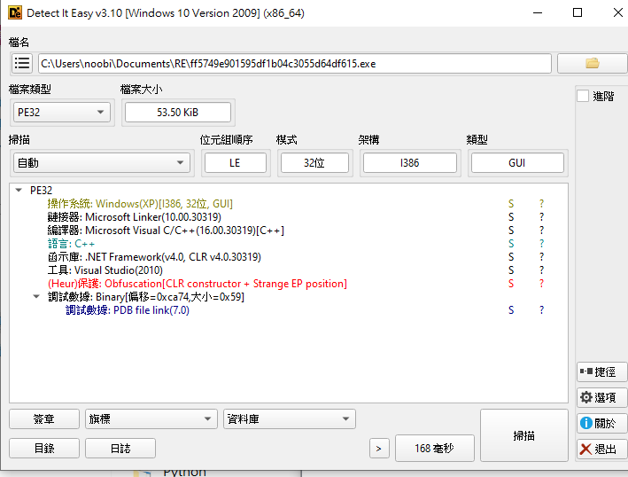

# [CTF Name] - [Challenge Name] Writeup
Can you see through the star

## 0. What are we gonna learn?
怎麽分辨是 C# 還是 C/C++ 程式, 并且該用 Dnspy 還是 Ollydbg

## 1. Challenge Information (題目資訊)
* **Category**: Reverse Engineering 
* **Points**: 2
* **Author**: Lazysoup
* **Date**: 2025-11-29

## 2. Description (題目描述)
> "Find the flag"


## 3. 解

 <br>
這代表它是用 Visual Studio 編譯的，但它掛載了 .NET 運行環境 (CLR)。 只要看到 "CLR" (Common Language Runtime) 或 ".NET Framework" 出現，不管上面寫什麼語言，它本質上就是跑在虛擬機上的程式。結論：必須使用 dnSpy 來分析。

因爲這是一個 C# 程式， 不要再 Linux 上用 wine 開，也不要用 Ollydbg 打開。 因爲 Ollydbg 只能分析 C/C++ 程式，DNSPY 是專門用來分析 C# 程式的，最好是在 Flare Vm 使用 dnspy 打開

首先會看到一個 button1_Click 的程式
```
private void button1_Click(object sender, EventArgs e)
{
	this.maskedTextBox1.Text = "FLAG-" + this.maskedTextBox1.Name + "vc" + this.button1.Name;
}
```
this.maskedTextBox1.Name 和 this.button1.Name 都在 Form1 找得到，然後拼接起來就行了


**Result**
FLAG-maskedTextBox1vcbutton1